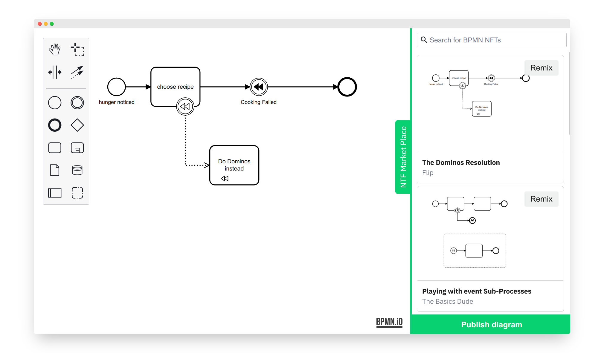

# bpmn-js-nft

[](https://github.com/nikku/bpmn-js-nft/actions/workflows/CI.yml)

A [NFT integration](https://www.forbes.com/advisor/investing/nft-non-fungible-token/) for [bpmn-js](https://github.com/bpmn-io/bpmn-js). [Read the announcement post](https://bpmn.io/blog/posts/2022-bpmn-js-nft-integration.html).





## Run locally

To run the application, execute:

```
npm start
```
